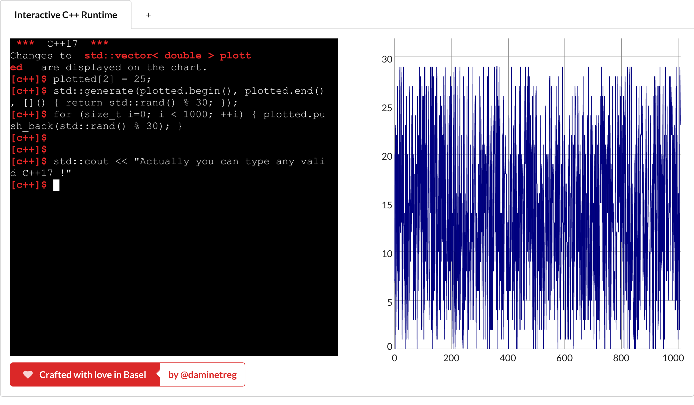

# trommeli
A C++ interactive programming environment that can plot.

A clever blend of cling, nodejs baked at [Basel carnival](http://www.baslerfasnacht.info/) heat.



## Prebuilt binaries
[Available on the releases page](https://github.com/daminetreg/trommeli/releases)

## License
```
trommeli  Copyright (c) 2018 Damien Buhl (alias daminetreg)
This program comes with ABSOLUTELY NO WARRANTY.
This is free software, and you are welcome to redistribute it
by reproducing this copyright notice and respecting the GPLv3.
```
[GPLv3](LICENSE)
